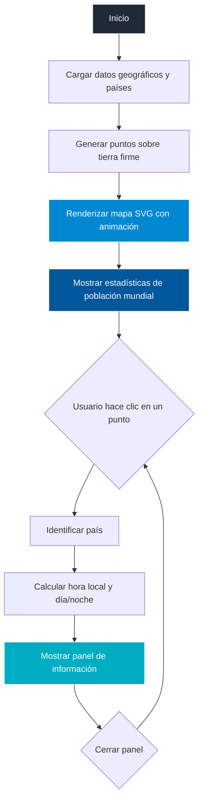

# 🌍 Mapa Mundial Interactivo


---

## Web en vivo

<div align="center">
  <a href="https://jhormancastella.github.io/Mapa-mundial/" target="_blank">
    
  </a>
</div>

---

## Descripción

**Mapa Mundial Interactivo** es una aplicación web que visualiza el mundo mediante puntos sobre tierra firme. Al hacer clic en cualquier punto puedes ver información detallada del país: capital, idiomas, población, hora local en tiempo real y si es de día o de noche en ese momento. Incluye un contador animado de población mundial con estadísticas globales.

---

## Características principales

- **Mapa de puntos interactivo**: proyección Equal Earth con hasta 3 000 puntos sobre tierra firme generados con D3.js.
- **Hora local en tiempo real**: calcula la hora actual de cada país según su zona horaria.
- **Efecto día/noche**: overlay visual que indica si el país está en horario diurno o nocturno.
- **Panel de información**: nombre, continente, capital, idiomas, población, bandera y hora local.
- **Contador de población mundial**: animación progresiva con total de países, promedio y país más poblado.
- **Diseño responsive**: layout adaptado para desktop, tablet y mobile con bottom-sheet en pantallas pequeñas.
- **Fallback de datos**: si la API falla, usa un conjunto local de 10 países principales.

---

## Vista rápida

| Característica | Estado |
|---|---|
| Mapa de puntos interactivo | ✅ |
| Hora local en tiempo real | ✅ |
| Efecto día/noche | ✅ |
| Panel de información por país | ✅ |
| Bandera nacional | ✅ |
| Contador de población mundial | ✅ |
| Diseño responsive (mobile/desktop) | ✅ |
| Bottom-sheet en mobile | ✅ |
| Fallback sin conexión a API | ✅ |
| Datos desde RestCountries API | ✅ |

---

## Flujo general



---

## Tecnologías utilizadas

- **HTML5** — Estructura semántica y metadatos responsive.
- **CSS3** — Grid, Flexbox, variables CSS, media queries y animaciones.
- **JavaScript ES6+** — Módulos, async/await, Intl API y requestAnimationFrame.
- **D3.js v7** — Proyección cartográfica, renderizado SVG y detección de puntos en tierra.
- **TopoJSON v3** — Datos geográficos del mundo en formato optimizado.
- **RestCountries API** — Información actualizada de países (nombre, capital, idiomas, población, banderas, zonas horarias).
- **World Atlas** — Topografía mundial a resolución 110m.

---

## Estructura del proyecto

```
Mapa-mundial/
├── index.html
├── css/
│   ├── base.css       # Reset, variables y estilos globales
│   ├── layout.css     # Grid, panel, stats y responsive
│   └── map.css        # Estilos específicos del SVG y puntos
└── js/
    ├── main.js        # Punto de entrada
    ├── map.js         # Generación del mapa y puntos
    ├── ui.js          # Panel de info y contadores
    ├── data.js        # Fetch de APIs y fallback
    └── timezone.js    # Cálculo de hora local y día/noche
```

---

## Instalación y uso local

1. Clona el repositorio:
```bash
git clone https://github.com/Jhormancastella/Mapa-mundial.git
```
2. Abre `index.html` en cualquier navegador moderno o usa **Live Server**.

> Requiere conexión a internet para cargar D3.js, TopoJSON y la RestCountries API.

---

## Licencia

Este proyecto es de código abierto bajo la autoría de **Jhorman Jesús Castellanos Morales**. Puedes usarlo, adaptarlo y mejorarlo libremente.

---

## Autor

**Jhorman Jesús Castellanos Morales**
[GitHub Profile](https://github.com/Jhormancastella)
